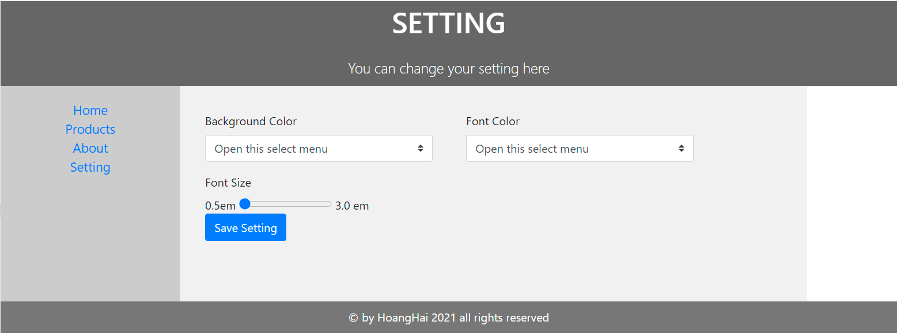
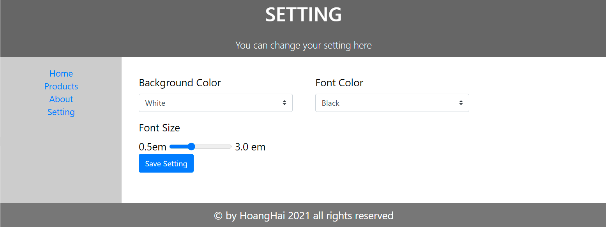
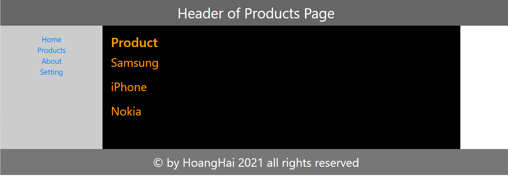
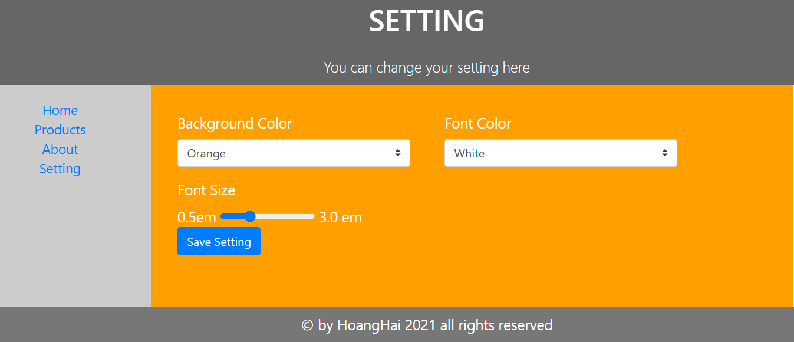
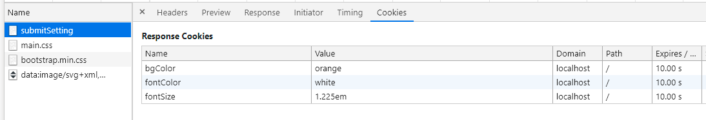

Demo Homework 11 
=======
## Website name: customers'cookies
 
---
### Review Q&A
**Questions**
  1. Mục đích của cookie là gì?
  2. Cookie là công nghệ chỉ có trong Spring Boot. Đúng hay Sai?
  3. Thuộc tính Expires/Max-Age tính bằng đơn vị gì? Ý nghĩa của nó là gì?
  4. Thuộc tính Domain của Cookie có ý nghĩa gì?
  5. Thuộc tính nào cho phép mã JavaScript ở client có thể đọc được giá trị của Cookie?
  6. Thuộc tính Path có tác dụng như thế nào?
  
**Answers:**
1. Cookie dùng để phía Server nhận diện người dùng ở mỗi request client gửi lên mà không cần đăng nhập hay xác minh lại. Ngoài ra còn ghi nhớ lựa chọn của client.
2. Sai, cookie được sử dụng rộng rãi trong tất cả các loại web, app trên Internet bất kể loại language hay framwork nào.
3. Đơn vị bằng giây. Ý nghĩa: sau bao nhiêu giây cookie sẽ bị xóa.
4. Thuộc tính domain chỉ ra tên miền, máy chủ nào sẽ nhận được cookie này.
5. Thuộc tính HttpOnly là false thì JS ở client đọc được cookie và ngược lại.
6. Thuộc tính Path dùng để khai báo những đường dẫn bắt buộc trong URL để server gủi cookies xuống client.

[Readmore in Mozilla](https://developer.mozilla.org/en-US/docs/Web/HTTP/Cookies)
## Code Practice Exercise
### Website Screens
**1. Setting page - before**

**2. Setting page - bgC: white, fontC: black, fontsize: 0.9em**

**3. Products Page - bgC: black, fontC: orange**

**4. Setting page- bgC: Orange, fontC: white**

**3. cookie lists**

