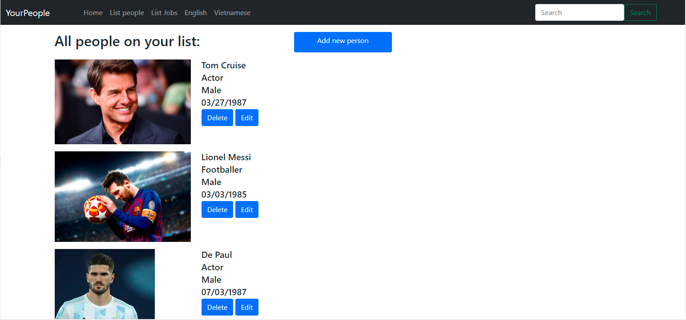
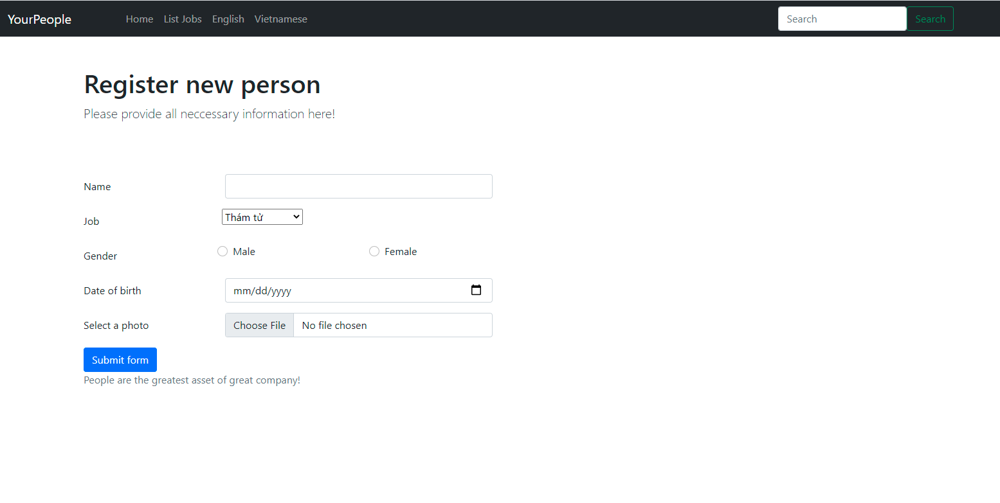
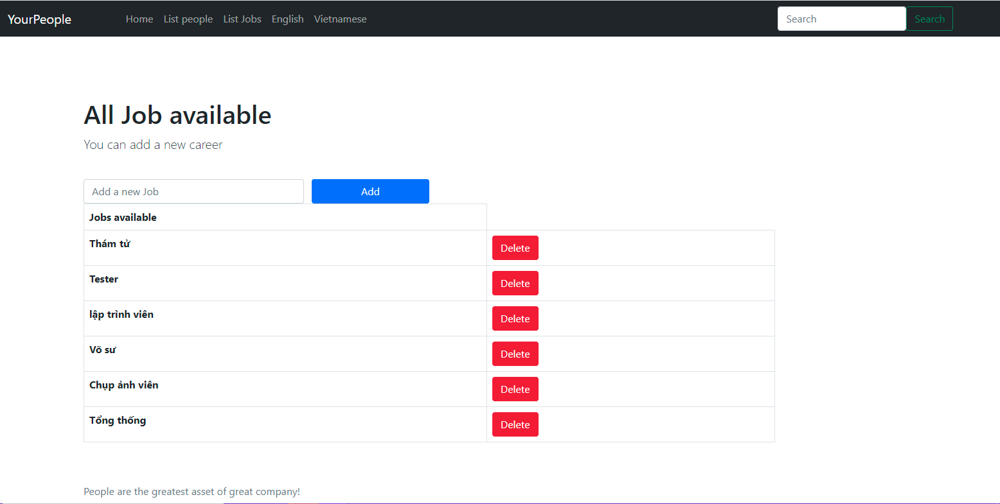

Demo Homework 10 
=======
## App name: peopleManager

---
### Functions of App
**1. People**
  1. Create new person save to DB, validate input information.
  2. Read people list from Repository.
  3. Update a person.
  4. Delete a person.
  
**2. Jobs**  
  1. Add a new Job list (Unique jobs).
  2. Show all job.
  3. Delete a job from list.

### App main views
**1. homepage**


**2. Register form**


**3. Job lists**


### Project Structure of Source file
```
   ├───src
    │   ├───main
    │   │   ├───java
    │   │   │   └───com
    │   │   │       └───peopleManager
    │   │   │           └───demo
    │   │   │               │   HomeworkDay10ForSpringBootCourseApplication.java
    │   │   │               │
    │   │   │               ├───Controllers
    │   │   │               │       RestController.java
    │   │   │               │
    │   │   │               ├───exception
    │   │   │               │       StorageException.java
    │   │   │               │
    │   │   │               ├───Models
    │   │   │               │       Job.java
    │   │   │               │       Person.java
    │   │   │               │
    │   │   │               ├───Repositories
    │   │   │               │       PeopleRepository.java
    │   │   │               │
    │   │   │               ├───Request
    │   │   │               │       gender.java
    │   │   │               │       PersonRequest.java
    │   │   │               │
    │   │   │               └───service
    │   │   │                       StorageService.java
    │   │   │
    │   │   └───resources
    │   │       │   application.properties
    │   │       │
    │   │       ├───static
    │   │       │   └───photos
    │   │       └───templates
    │   │           │   home.html
    │   │           │   listJobs.html
    │   │           │   listPeople.html
    │   │           │   register.html
    │   │           │   showError.html
    │   │           │   template.html
    │   │           │
    │   │           └───error
    │   │                   404.html
```

