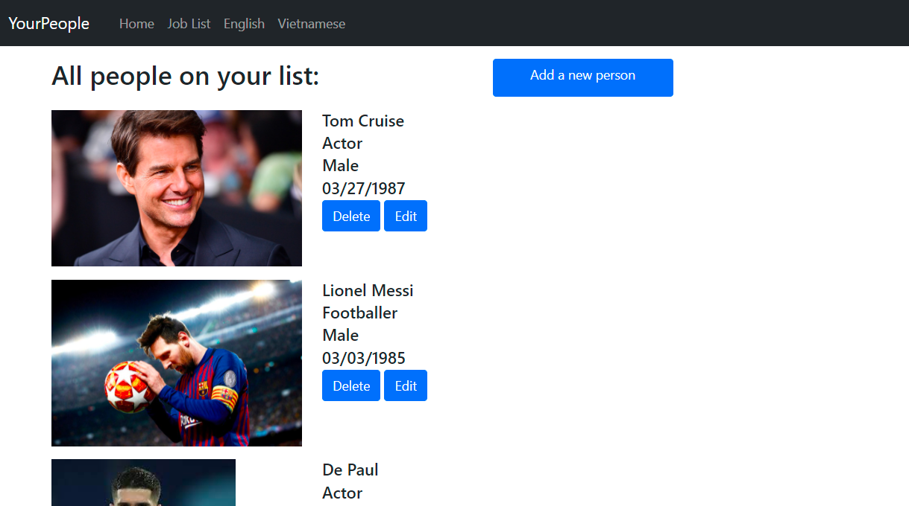
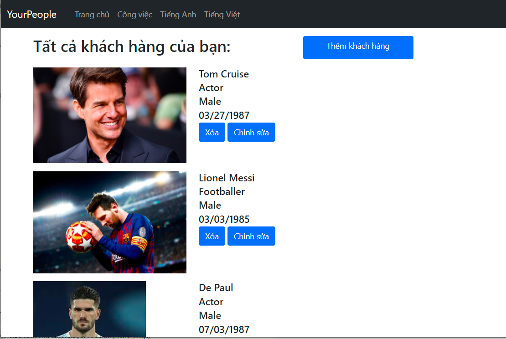
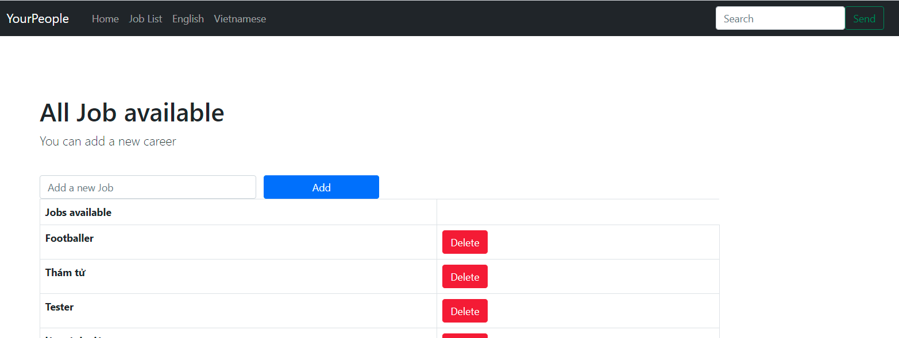
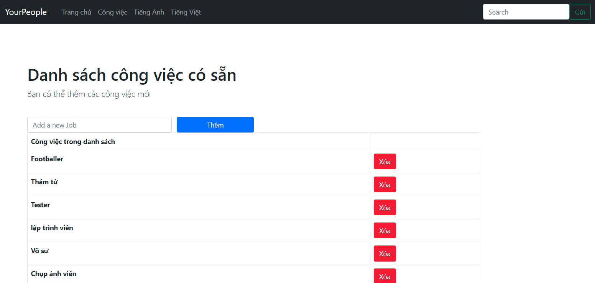

Demo Homework 12
=======
## App name: peopleManager

---
### Functions of Website
**Language support**
  1. Vietnamese
  2. English
  
**1. People**
  1. Create new person save to DB, validate input information.
  2. Read people list from Repository.
  3. Update a person.
  4. Delete a person.
  
**2. Jobs**  
  1. Add a new Job list (Unique jobs).
  2. Show all job.
  3. Delete a job from list.

### App main views
**1. Homepage**

**English**


**Vietnamese**


**2. Job lists**

**English**


**Vietnamese**


**3. Register form**


### Project Structure of Source file
```
   ├───src
   │   ├───main
   │   │   ├───java
   │   │   │   └───com
   │   │   │       └───peopleManager
   │   │   │           └───demo
   │   │   │               │   HomeworkDay10ForSpringBootCourseApplication.java
   │   │   │               │
   │   │   │               ├───config
   │   │   │               │       LanguageConfig.java
   │   │   │               │
   │   │   │               ├───Controllers
   │   │   │               │       RestController.java
   │   │   │               │
   │   │   │               ├───exception
   │   │   │               │       StorageException.java
   │   │   │               │
   │   │   │               ├───Models
   │   │   │               │       Job.java
   │   │   │               │       Person.java
   │   │   │               │
   │   │   │               ├───MultiLangMessageSource
   │   │   │               │       Message.java
   │   │   │               │       MessageSourceImp.java
   │   │   │               │
   │   │   │               ├───Repositories
   │   │   │               │       PeopleRepository.java
   │   │   │               │
   │   │   │               ├───Request
   │   │   │               │       gender.java
   │   │   │               │       PersonRequest.java
   │   │   │               │
   │   │   │               └───service
   │   │   │                       StorageService.java
   │   │   │
   │   │   └───resources
   │   │       │   application.properties
   │   │       │
   │   │       ├───static
   │   │       │   └───photos
   │   │       └───templates
   │   │           │   failure.html
   │   │           │   home.html
   │   │           │   listJobs.html
   │   │           │   listPeople.html
   │   │           │   register.html
   │   │           │   showError.html
   │   │           │   template.html
   │   │           │
   │   │           └───error
   │   │                   404.html
```

