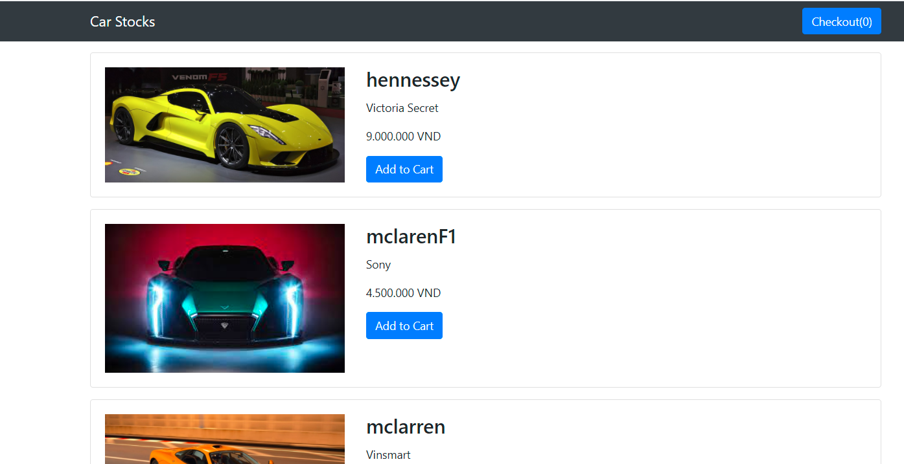
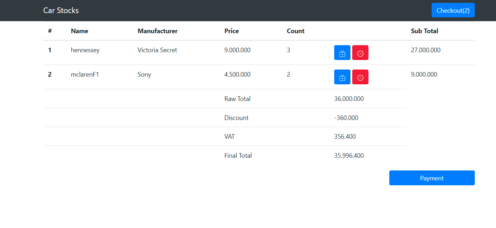
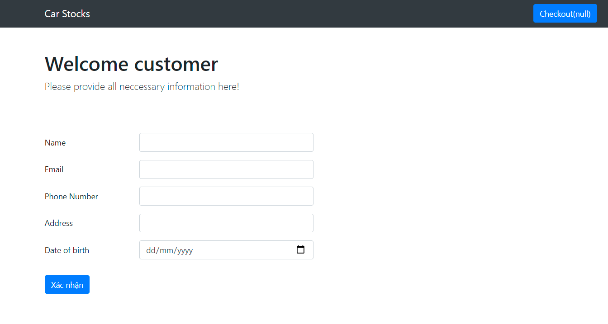
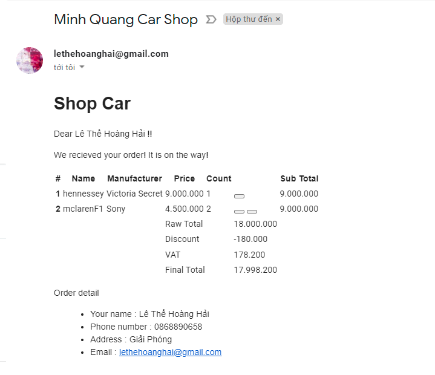

SpringBoot Homework 14
===
## CarShop Website:
Topics: Session + java email

---
### Describe the web main functions:
1. Customer can click item adnd add to cart.
2. The customers' choice will be remembered in session.
3. After click checkout Cart, customer will see the Order details.
4. After click confirm payment, customer will fill a form of personal detail information. Session also be destroyed here.
5. After click send form which provide email address. There will be an email automatically send to customer about personal infor and order detail.
    Also there will be a link to confirm the email.  
    
### Web main views

**Home page**

**Order page**

**Form page**

**Email confirm**
