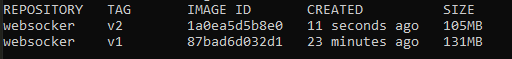
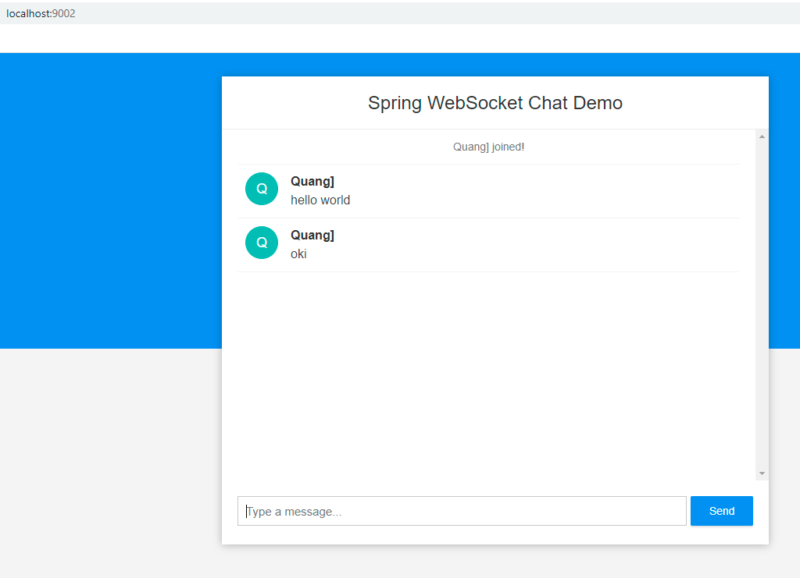

# Homework build IMG Dockerfile của SpringBoot APP

## Dockerfile Code 
### Cách 1: Multiple stage với 2 bước
```Dockerfile
#stage 1 mvn clean
FROM maven:ibmjava-alpine AS jarBuild
WORKDIR /build
COPY src src 
COPY pom.xml pom.xml
RUN mvn -f pom.xml clean package -Dmaven.test.skip

#stage2. build JAR
FROM openjdk:8-alpine
WORKDIR /first-SB-app-dockerImg
COPY --from=jarBuild /build/target/websocket-demo-0.0.1-SNAPSHOT.jar websocket.jar
CMD java -Djava.security.egd=file:/dev/./urandom -jar websocket.jar
```

### Cách 2: Chạy mvn trước:
./mvnw package

Sau đó chạy Dockerfile với nội dung sau
```Dockerfile
FROM openjdk:8-jdk-alpine
ARG JAR_FILE=target/*.jar
WORKDIR /first-SB-app-dockerImg
COPY ${JAR_FILE} app.jar
ENTRYPOINT ["java","-jar","/app.jar"]
```

## Lệnh Run Img và build Docker container

Lệnh build image: 
```cmd
Docker build -f Dockerfile -t websocker:v1 .
Docker build -f Dockerfile.cach2 -t websocker:v2 .
```

Kết quả tạo ra được image sau:


Lệnh run container:
```cmd
Docker run -d --rm --name websocket -p 9002:8080 websocker:v1
```
## Hình ảnh sản phẩm sau khi chạy



