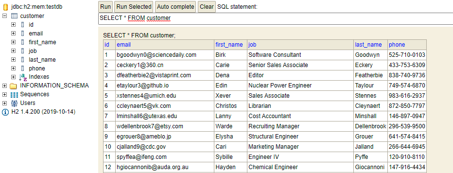

Homework 14
===
# Topic: JPA + h2

## Yêu cầu đề bài
1. Tạo 1 project với các dependencies: JPA, H2, Lombok
2. Bổ sung cấu hình vào application.properties
3. Tạo các thư mục model, repository
4. Định nghĩa model Customer.java: firstName,lastName, email, mobile, job.
5. Dùng https://www.mockaroo.com/ tạo ra 20 bản ghi, xử lý các tác vụ truy vấn theo email,job,lastName,firstName sắp xếp theo các trường trên h2 console
6. Có thể xử lý các tác vụ xử lý trên database qua lớp Service và ghi ra terminal: sắp xếp dữ liệu theo các trường, tìm kiếm Customer có firstName hoặc lastName chứa từ khóa
Yêu cầu ghi rõ các bước, chụp màn hình trong file Readme.md

## Steps
**Bước 1 Add Dependency** jpa, h2, lombok

**Bước 2 Cấu hính Application Properties**
```
spring.datasource.url=jdbc:h2:mem:testdb;DB_CLOSE_DELAY=-1;DATABASE_TO_UPPER=false;
spring.datasource.driverClassName=org.h2.Driver
spring.datasource.username=sa
spring.datasource.password=
spring.jpa.database-platform=org.hibernate.dialect.H2Dialect
spring.h2.console.enabled=true
spring.jpa.defer-datasource-initialization=true

spring.jpa.generate-ddl=true
spring.jpa.hibernate.ddl-auto=create-drop
spring.jpa.show-sql=true
```
**Bước 3. Vào Mockaro tạo 100 record và import dạng file SQL**
**src/main/resources/data-oracle.sql:**
```
insert into...
insert into...
```
You may define the platform with: spring.datasource.platform=oracle.
You may change the name of the sql script to load with: spring.datasource.data=myscript.sql.

Along with data.sql, Spring-boot also loads schema.sql (before data.sql).

Tạo 100 bản lưu sql theo mẫu như sau, đặt tên file là data.sql 
```
insert into customer (first_name, last_name, email, phone, job) values ('Birk', 'Goodwyn', 'bgoodwyn0@sciencedaily.com', '525-710-0103', 'Software Consultant');
insert into customer (first_name, last_name, email, phone, job) values ('Carie', 'Eckery', 'ceckery1@360.cn', '433-753-6309', 'Senior Sales Associate');
insert into customer (first_name, last_name, email, phone, job) values ('Dena', 'Featherbie', 'dfeatherbie2@vistaprint.com', '838-740-9736', 'Editor');
```
Lưu ý: Cách đặt tên table, column không được có viết hoa, nếu không sẽ lỗi ngay quá trình insert SQL.
Trùng với tên cột trong java class gắn @Entity

[link how to run sql](https://stackoverflow.com/questions/39280340/how-to-run-sql-scripts-and-get-data-on-application-startup)

**Bước 4. Thêm dependencies cho phần Test nếu dùng JUNIT**
```java
<dependency>
    <groupId>org.junit.jupiter</groupId>
    <artifactId>junit-jupiter-api</artifactId>
    <version>5.7.0</version>
    <scope>test</scope>
</dependency>
<dependency>
    <groupId>org.assertj</groupId>
    <artifactId>assertj-core</artifactId>
    <version>3.18.1</version>
    <scope>test</scope>
</dependency>
```
**Bước 5**
Tạo class Customer trong package model, đại diện cho một bảng
```java
@Entity (name="customer")
@Table(name="customer")
@NoArgsConstructor
@AllArgsConstructor
public class Customer {
    @Id
    @GeneratedValue(strategy= GenerationType.IDENTITY)
    private long id;

    @Column(name="first_name")
    private String firstName;

    @Column(name="last_name")
    private String lastName;
    @Column(name="email")
    private String email;
    @Column(name="phone")
    private String phone;
    @Column(name="job")
    private String job;
}
```

**Bước 6 Tạo repository**
```java
@Repository
public interface CustomerRepository extends JpaRepository<Customer, Long> {
    Optional<Customer> findById(long id);
    Optional<Customer> findByEmail(String email);
    List<Customer> findByJob(String job);
    List<Customer> findByFirstName(String firstName);
    List<Customer> findByLastName(String lastName);
}
```
**Bước 7. Tạo file Test**
```java
@DataJpaTest
@Sql({"/data.sql"})
@Slf4j
public class CustomerTest {
    @Autowired
    CustomerRepository customerRepo;

    // Tim khach hang co Id = 99;
    @Test
    public void findById() {
        Customer cus1 = customerRepo.findById(99L).get();
        System.out.print("Customer id 99: ");
        System.out.println(cus1);
        assertThat(cus1.getId()).isEqualTo(99L);
    }

    // Tim khach hang co email = "JohnSmith@";
    @Test
    public void findByEmail(){
        Customer cus2 = customerRepo.findByEmail("egrouer8@ameblo.jp").get();
        System.out.print("Customer who has email: egrouer8@ameblo.jp ");
        System.out.println(cus2);
        assertThat(cus2.getEmail()).isEqualTo("egrouer8@ameblo.jp");
    }


    // Tim danh sach khach hang firstname = " John"
    @Test
    public void findByFirstName(){
        System.out.print("Customers who has FN as JOHN ");
        List<Customer> customersJohn = customerRepo.findByFirstName("John");
        customersJohn.forEach(System.out::println);
        assertThat(customersJohn.size()).isGreaterThan(2);
    }

    // Tim danh sach khach hang lastname = " Grubey"
    @Test
    public void findByLastName(){
        System.out.print("Customer who has LN as Grubey ");
        List<Customer> customersLName = customerRepo.findByFirstName("Grubey");
        customersLName.forEach(System.out::println);
        assertThat(customersLName.size()).isGreaterThan(1);
    }

    // Tim danh sach khach hang job = "Cost Accountant"
    public void findByJob(){
        System.out.print("Customers work as Cost Accountant");
        List<Customer> findByJob = customerRepo.findByFirstName("Cost Accountant");
        findByJob.forEach(System.out::println);
        assertThat(findByJob.size()).isGreaterThan(5);
    }
}
```
**Bước 8. Lựa chọn thay thế: Thêm lệnh thực thi chương trình trong main của Appication để test**
```java
@SpringBootApplication
public class DemoApplication {
	public static void main(String[] args) {
		// ApplicationContext chính là container, chứa toàn bộ các Bean
		ApplicationContext context = SpringApplication.run(DemoApplication.class, args);
		CustomerRepository customerRepo = context.getBean(CustomerRepository.class);

		// Tim khach hang co Id = 99;
		Customer cus1 = customerRepo.findById(99L).get();
		System.out.print("Customer id 99: ");
		System.out.println(cus1);

		// Tim khach hang co email = "JohnSmith@";
		Customer cus2 = customerRepo.findByEmail("egrouer8@ameblo.jp").get();
		System.out.print("Customer who has email: egrouer8@ameblo.jp ");
		System.out.println(cus2);

		// Tim danh sach khach hang firstname = " John"
		System.out.print("Customers who has FN as JOHN ");
		List<Customer> customersJohn = customerRepo.findByFirstName("John");
		Iterator<Customer> listIterator1 = customersJohn.iterator();
		while(listIterator1.hasNext()) {
			System.out.println(listIterator1.next());
		}
		System.out.println("----------------");

		// Tim danh sach khach hang lastname = " Smith"
		System.out.print("Customer who has LN as Smith ");
		List<Customer> customersLnSmith = customerRepo.findByLastName("Smith");
		Iterator<Customer> listIterator2 = customersLnSmith.iterator();
		while(listIterator2.hasNext()) {
			System.out.println(listIterator2.next());
		}
		System.out.println("----------------");

		// Tim danh sach khach hang job = "Cost Accountant"
		System.out.print("Customers work as Cost Accountant ");
		List<Customer> customersDeveloper = customerRepo.findByJob("Cost Accountant");
		Iterator<Customer> listIterator3 = customersJohn.iterator();
		while(listIterator3.hasNext()) {
			System.out.println(listIterator3.next());
		}
		System.out.println("----------------");
	}
```

## Kiểm tra kết quả
1. Vào trang localhost:8080/h2-console
Thấy một bảng db rất đẹp như sau


2. Run chương trình và xem console log để kiểm tra kết quả in ra ta thấy các Test case đã pass!
