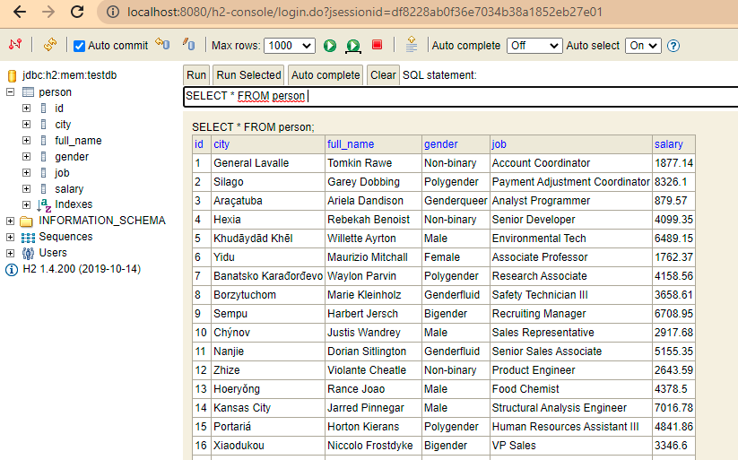

Homework 29
===
## Topic : JPA, Junit, h2console

---
### Requirements :
Tạo một project có các dependencies với H2,JPA,AssertJ,Junit
Tạo entity: Person (id,fullName,job,gender,city,salary,sex)
Tạo 1 bảng Person.sql có các trường tương ứng (100 bản ghi) để test
Thực hiện các truy vấn sau trong repository:
- Đếm số người theo từng công việc theo thứ tự giảm dần
- Đếm top 5 công việc có nhiều người làm nhất
- Đếm số lượng người nhóm theo từng công việc và cùng thành phố
- Đếm mức lương trung bình theo từng công việc thứ tự giảm dần
- Đếm mức lương trung bình theo từng thành phố thứ tự giảm dần
- Đếm 5 công việc nhiều nhất theo từng thành phố

Thực hiện UnitTest cho các trường hợp này.
Chú ý: ghi các bước thực hiện và kết quả trong file Readme.md

### Các bước tiến hành:
**Bước 1** Tạo project với các library: JPA, h2, lombok, starter-web
Bổ sung vào file Pom dependencies để làm Junit test
```pom.xml
        <dependency>
            <groupId>org.junit.jupiter</groupId>
            <artifactId>junit-jupiter-api</artifactId>
            <version>5.7.0</version>
            <scope>test</scope>
        </dependency>
        <dependency>
            <groupId>org.assertj</groupId>
            <artifactId>assertj-core</artifactId>
            <version>3.18.1</version>
            <scope>test</scope>
        </dependency>
```
**Bước 2** Tạo entity person
```java
@Entity
@Data
public class Person {
    @Id
    @GeneratedValue(strategy= GenerationType.IDENTITY)
    private long id;
    @Column(name="full_name")
    private String fullName;
    @Column
    private String gender;
    @Column
    private String job;
    @Column
    private String city;
    @Column
    private String salary;
}
```
**Bước 3** Vào mockaroo để tạo cơ sở dữ liệu dạng sql
```
insert into person (full_name, gender, job, city, salary) values ('Tomkin Rawe', 'Non-binary', 'Account Coordinator', 'General Lavalle', 1877.14);
insert into person (full_name, gender, job, city, salary) values ('Garey Dobbing', 'Polygender', 'Payment Adjustment Coordinator', 'Silago', 8326.10);
insert into person (full_name, gender, job, city, salary) values ('Ariela Dandison', 'Genderqueer', 'Analyst Programmer', 'Araçatuba', 879.57);
```

**Bước 4** Cấu hình application.properties
```
spring.datasource.url=jdbc:h2:mem:testdb;DB_CLOSE_DELAY=-1;DATABASE_TO_UPPER=false;
spring.datasource.driverClassName=org.h2.Driver
spring.datasource.username=sa
spring.datasource.password=
spring.jpa.database-platform=org.hibernate.dialect.H2Dialect
spring.h2.console.enabled=true
spring.jpa.defer-datasource-initialization=true

spring.jpa.generate-ddl=true
spring.jpa.hibernate.ddl-auto=create-drop
spring.jpa.show-sql=true
```

**Bước 5** Tạo thêm một số model để hứng kết quả
Chú ý: count phải để là long chứ không được để int
```java
@AllArgsConstructor
@NoArgsConstructor
@Data
public class CountPeopleByJob {
    String job;
    long count;
}
```
```java
@AllArgsConstructor
@NoArgsConstructor
@Data
public class CountGroupByJobAndCity {
    String job;
    String city;
    long count;
}
```
**Bước 6** Tạo repository.
Note: Query spaceX err.
Must right order to constructor.
```java
@Repository
public interface PersonRepository extends JpaRepository<Person, Long> {
    //    Đếm số người theo từng công việc theo thứ tự giảm dần
    @Query
            (
                    "SELECT new com.TechmasterHW30.JPA.h2.Junit.QueryModels.CountPersonByJob(p.job, COUNT(*))" +
                    " FROM person AS p" +
                    " GROUP BY p.job" +
                    " ORDER BY 2 DESC"
            )
    List<CountPeopleByJob> CountPeopleByJob();

    //    Đếm top 5 công việc có nhiều người làm nhất
    @Query
        (
                "SELECT new com.TechmasterHW30.JPA.h2.Junit.QueryModels.CountPersonByJob(p.job, COUNT(*))" +
                " FROM person AS p" +
                " GROUP BY p.job" +
                " ORDER BY 2 DESC"
        )
    List<CountPeopleByJob> CountPersonByJobTop5(Pageable pageable);

    //    Đếm số lượng người nhóm theo từng công việc và cùng thành phố
    @Query
        (
                "SELECT new com.TechmasterHW30.JPA.h2.Junit.QueryModels.CountGroupByJobAndCity(p.job,p.city, COUNT(*)" +
                " FROM person AS p " +
                "GROUP BY p.job, p.city " +
                "ORDER BY 3 DESC"
        )
    List<CountGroupByJobAndCity>countGroupByJobAndCity();

    //Mức lương trung bình theo từng công việc thứ tự giảm dần

    @Query
        (
                "SELECT new com.TechmasterHW30.JPA.h2.Junit.QueryModels.AvgSalaryGroupJob(p.job, AVG(p.salary)) "+
                "FROM person AS p GROUP BY p.job ORDER BY 2 DESC"
        )
    List<AvgSalaryGroupJob> avgSalaryByJob();

    //Mức lương trung bình theo từng thành phố thứ tự giảm dần
    @Query
    (
        "SELECT new com.TechmasterHW30.JPA.h2.Junit.QueryModels.AvgSalaryGroupCity(p.city, AVG(p.salary)) "+
        "FROM person AS p GROUP BY p.city ORDER BY 2 DESC"
    )
    List<AvgSalaryGroupCity> avgSalaryByCity();

    //Đếm 5 công việc nhiều nhất theo từng thành phố
    @Query("SELECT new com.TechmasterHW30.JPA.h2.Junit.QueryModels.CityHasMostOfAJob(city, job, COUNT(job)) " +
            "FROM person GROUP BY city, job HAVING job = ?1 ORDER BY 3 DESC")
    List<TopJobGroupByCity> topJobByCity(String job, Pageable pageable);
    //https://stackoverflow.com/questions/2129693/using-limit-within-group-by-to-get-n-results-per-group
}
```
**Bước 6** Tạo Junit Test
```java
@DataJpaTest
@Sql({"/data.sql"})
@Slf4j
public class PersonRepoTest {

    @Autowired
    PersonRepository personRepo;

    @Test
    public void countByJob(){
        List<CountPeopleByJob> peopleList = personRepo.CountPeopleByJob();
        log.info("Top job DESC");
        peopleList.forEach(System.out::println);
        assertThat(peopleList.size()).isGreaterThan(2);
    }

    //https://www.baeldung.com/spring-data-jpa-pagination-sorting
    @Test
    public void CountPersonByJobTop5(){
        Pageable pageable = (Pageable) PageRequest.of(0,5);
        List<CountPeopleByJob> topfiveJobs = personRepo.CountPersonByJobTop5(pageable);
        log.info("TopfiveJob");
        topfiveJobs.forEach(System.out::println);
        assertThat(topfiveJobs.size()).isGreaterThan(2);
    }

    @Test
    public void countGroupByJobAndCity(){
        List<CountGroupByJobAndCity> peopleList = personRepo.countGroupByJobAndCity();
        log.info("nums of people each job in each city");
        peopleList.forEach(System.out::println);
        assertThat(peopleList.size()).isGreaterThan(2);
    }

    @Test
    public void avgSalaryByJob(){
        List<AvgSalaryGroupJob> peopleList = personRepo.avgSalaryByJob();
        log.info("average sal by job");
        peopleList.forEach(System.out::println);
        assertThat(peopleList.size()).isGreaterThan(2);
    }

    @Test
    public void avgSalaryByCity(){
        List<AvgSalaryGroupCity> peopleList = personRepo.avgSalaryByCity();
        log.info("average sal by city");
        peopleList.forEach(System.out::println);
        assertThat(peopleList.size()).isGreaterThan(2);
    }

    @Test
    public void topCitiesHasAJob(){
        Pageable pageable = PageRequest.of(0,5);
        List<CityHasMostOfAJob> peopleList = personRepo.topCitiesHasAJob("Associate Professor", pageable);
        log.info("Top 5 city have most APs");
        peopleList.forEach(System.out::println);
        assertThat(peopleList.size()).isGreaterThan(0);
    }
}
```
### Kiểm tra kết quả chương Trình
**1. Vào localhost:8080/h2-console:**



**2. Chạy JUnit Test kết quả như sau:**

