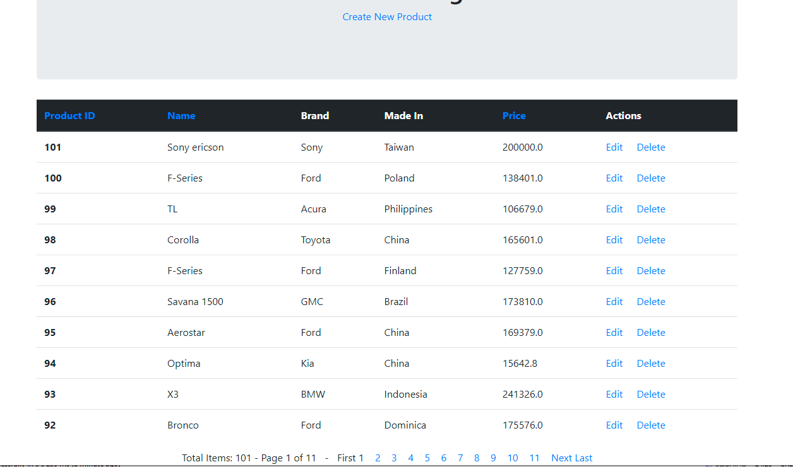
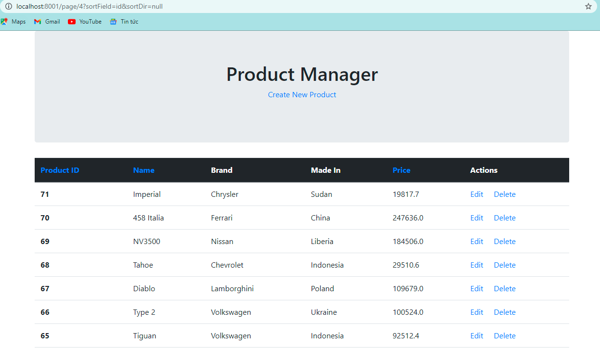
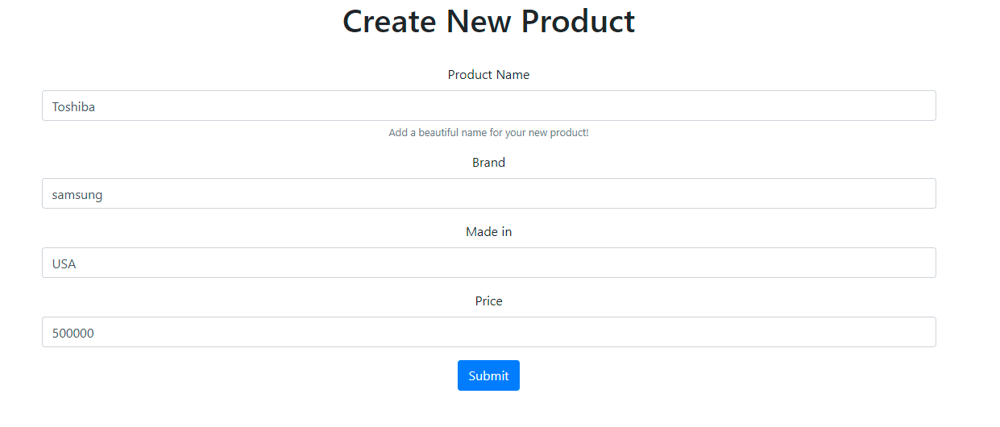
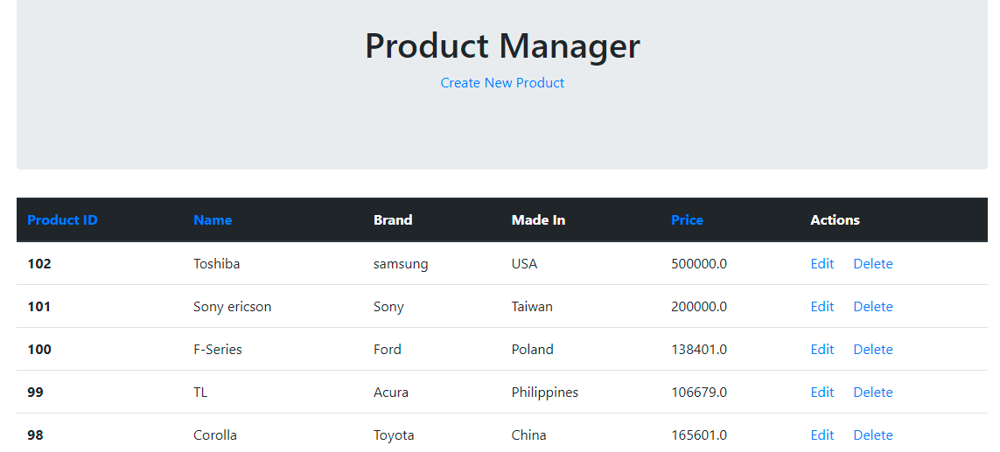
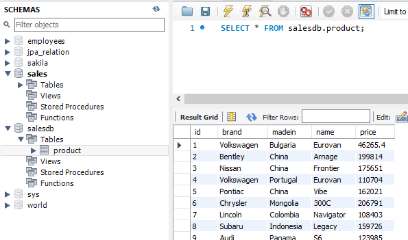

Homework 30. Spring boot 
===
## Topic: mySQL, paging & Sorting 

---
## Requirements:
Tạo một Entity Product có các trường: id,name,brand,madein,price

Tạo một bản ghi product.sql lưu các thông tin để trong H2 database hoặc load vào mysql.

Hiển thị list Product theo từng trang, sắp xếp theo ID,Name,Price

## Steps:
**Bước 1** Tạo project với lib: JPA, Spring web, lombok, thymeleaf.
Thêm vào file POM connect to mySQL dependency:
```
    <dependency>
        <groupId>mysql</groupId>
        <artifactId>mysql-connector-java</artifactId>
        <scope>runtime</scope>
     </dependency>

<-- và bootstrap --> 
    <dependency>
        <groupId>org.webjars</groupId>
        <artifactId>bootstrap</artifactId>
        <version>4.5.3</version>
    </dependency>
    <dependency>
        <groupId>org.webjars</groupId>
        <artifactId>webjars-locator-core</artifactId>
    </dependency>
```
**Bước 2: mở MySQL server đồng thời cấu hình:**
```
server.port=8001
spring.jpa.hibernate.ddl-auto=update
# spring.jpa.properties.hibernate.hbm2ddl.import_files=product.sql
spring.datasource.url=jdbc:mysql://127.0.0.1:3306/salesdb?useSSL=false&serverTimezone=UTC
spring.datasource.username = root
spring.datasource.password = root

spring.jpa.show-sql=true
spring.jpa.properties.hibernate.format_sql = true;
spring.jpa.properties.hibernate.dialect = org.hibernate.dialect.MySQL5InnoDBDialect
logging.level.org.hibernate = ERROR

```
**Bước 3: Tạo class Product**
```java
@Data
@Entity
@Table(name = "product")
@AllArgsConstructor
public class Product {
    @Id
    @GeneratedValue(strategy = GenerationType.IDENTITY)
    private Integer id;
    private String name;
    private String brand;
    private String madein;
    private float price;
}
```
**Bước 4: Tạo ProductRepository extends JpaRepository**

**Bước 5: Tạo ProductService**
```java
@Service
public class ProductService {
    @Autowired
    ProductRepository productRepo;

    Page<Product> pageAndSort(int page, String fieldSort, String SortDir) {
        Sort sort = Sort.by(fieldSort);
        sort= (SortDir.equals("asc"))? sort.ascending() : sort.descending();

        Pageable pageable = PageRequest.of(page-1, 10, sort);
        return productRepo.findAll(pageable);
    }

    void save(Product product){
        productRepo.save(product);
    }
    public Product get(Integer id) {
        return productRepo.findById(id).get();
    }
    public void delete(Integer id) {
        productRepo.deleteById(id);
    }
}
```
**Bước 6: Tạo Controller**
```java
@org.springframework.stereotype.Controller
public class Controller {
    @Autowired
    ProductService productService;

    @GetMapping("")
    String home(Model model) {
        return listProductPaging(1,model,"name","asc");
    }

    @GetMapping("/page/{pageNumber}")
    String listProductPaging(@PathVariable("pageNumber") int pageNumber, Model model,
                             @Param("sortField") String sortField,
                             @Param("sortDir") String sortDir){
        Page<Product> page = productService.pageAndSort(pageNumber, sortField, sortDir);
        List<Product> products = page.getContent();

        long totalItems = page.getTotalElements();
        int totalPages = page.getTotalPages();
        sortDir = (sortDir.equals("asc")) ? "desc" : "asc";

        model.addAttribute("currentPage", pageNumber);
        model.addAttribute("sortField", sortField);
        model.addAttribute("sortDir", sortDir);
        //new model
        model.addAttribute("totalItems",totalItems);
        model.addAttribute("totalPages",totalPages);
        model.addAttribute("listProducts", products);

        return "index";
    }
}
```
**Bước 7: Tạo Template Thymeleaf**

## Chạy chương trình và kiểm tra kết quả
**homePage**



**page 4**



**new product page**



**Kết quả sau khi add 2 product mới lên đầu list**



**Kiểm tra dữ liệu trong mySQL**



